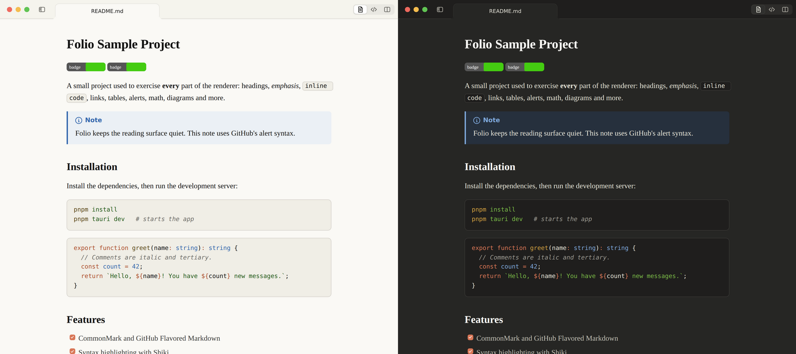

# Folio

A native Markdown viewer for macOS: quiet, fast, read-only, and good enough to
be the default app for every `.md` file. Built with Tauri 2, React and a
render pipeline that never blocks the window.



<sub>Screenshots are from the e2e harness (Chromium on Linux, drawn traffic lights),
so fonts differ slightly from macOS.</sub>

- **Opens like Preview.app.** Double-click in Finder, drop files anywhere,
  ⌘O for files *and* folders, Open Recent, `folio README.md` from Terminal.
  Ten files become ten tabs in one window; the same file never opens twice.
- **The document is the interface.** Claude's warm ivory reading surface (or
  GitHub, Paper, or your own CSS), tabs in the title bar, nothing else.
- **Everything GitHub renders:** GFM tables and task lists, alerts,
  footnotes, emoji, front matter, KaTeX math, Mermaid diagrams, syntax
  highlighting for 200+ languages, and GitHub's heading anchors.
- **Preview, Code and Split** (⌘/, ⌘\\) with scroll sync, a sidebar with the
  outline and folder files, Find, Open Quickly (⇧⌘O), back/forward history.
- **Live reload** that keeps your place and briefly highlights what changed.
- **Private.** Folio never modifies your files, has no telemetry, bundles
  every asset, and only reaches the network for images a document itself
  references.

See [PLAN.md](PLAN.md) for the architecture and IPC contract,
[DECISIONS.md](DECISIONS.md) for the non-obvious calls, and
[ACCEPTANCE.md](ACCEPTANCE.md) for what was verified and how. The in-app
guide is [src-tauri/resources/help.md](src-tauri/resources/help.md) (Help ▸
Folio Help).

## Requirements

- macOS 13 Ventura or later (Apple silicon or Intel; the release build is
  universal).
- To build: Xcode Command Line Tools, [Rust](https://rustup.rs) (stable),
  Node.js 22+, and pnpm 10.

## Build and run

```console
$ pnpm install
$ pnpm tauri dev                 # development, with hot reload
```

Release build (universal binary, `.app` and `.dmg`):

```console
$ rustup target add aarch64-apple-darwin x86_64-apple-darwin
$ pnpm tauri build --target universal-apple-darwin
```

The bundle lands in
`src-tauri/target/universal-apple-darwin/release/bundle/{macos,dmg}/`. Move
`Folio.app` to `/Applications`, open it once, and accept the offer to make it
the default Markdown app (or use **Settings ▸ General ▸ Make Default**).
**Folio ▸ Install Command Line Tool…** adds the `folio` command.

### Signing

**Local builds are signed ad hoc** (`bundle.macOS.signingIdentity: "-"` in
`src-tauri/tauri.conf.json`), with the hardened runtime on. That's enough to
run on the Mac that built it. A copy moved to another Mac is quarantined by
Gatekeeper; open it with right-click ▸ Open, or remove the attribute with
`xattr -dr com.apple.quarantine /Applications/Folio.app`.

**Distribution builds need a Developer ID certificate and notarization.** The
Tauri bundler does both when these environment variables are set:

```console
$ export APPLE_SIGNING_IDENTITY="Developer ID Application: Your Name (TEAMID)"

# Notarization with an App Store Connect API key (recommended) …
$ export APPLE_API_ISSUER="…"  APPLE_API_KEY="…"  APPLE_API_KEY_PATH="$HOME/keys/AuthKey_….p8"
# … or with an Apple ID and an app-specific password
$ export APPLE_ID="you@example.com"  APPLE_PASSWORD="app-specific-password"  APPLE_TEAM_ID="TEAMID"

$ pnpm tauri build --target universal-apple-darwin
```

`APPLE_SIGNING_IDENTITY` overrides the ad-hoc identity. The certificate must
be in your login keychain; on CI, also set `APPLE_CERTIFICATE` (the `.p12`,
base64-encoded) and `APPLE_CERTIFICATE_PASSWORD`, and the bundler imports it
into a temporary keychain. After the build, the bundler submits the app to
Apple's notary service, waits, and staples the ticket. Check the result:

```console
$ codesign --verify --deep --strict --verbose=2 Folio.app
$ spctl --assess --type execute --verbose Folio.app      # "source=Notarized Developer ID"
$ xcrun stapler validate Folio.app
```

Folio needs no extra entitlements: it isn't sandboxed (it opens files from
anywhere, like Preview), WebKit's JIT runs in WebKit's own processes, and the
only private API is the one that keeps the web view from painting white
before the first frame (see DECISIONS.md), which is fine outside the App
Store.

Before distributing, change the placeholder bundle identifier
`dev.yourname.folio` in `src-tauri/tauri.conf.json`, `BUNDLE_ID` in
`src-tauri/src/paths.rs` and `src-tauri/resources/bin/folio`; Rust tests fail
until all three agree.

## The `folio` command

```console
$ folio README.md docs/*.md          # open files, each in a tab
$ folio .                            # a folder, with its README
$ cat notes.md | folio -             # standard input
$ folio --split --line 120 CHANGELOG.md
$ folio --new-window guide.md
$ folio --help
```

Plain paths go through `open -b`, exactly like a Finder double-click, whether
or not Folio is running. Options travel in a `folio://open?path=…` link,
which Folio treats as untrusted input: it opens existing Markdown files and
folders and does nothing else.

## Tests

```console
$ pnpm test                          # Vitest: rendering, sanitizer, regex cache, helpers
$ cd src-tauri && cargo test         # Rust: decoding, access policy, deep links, CLI, …
$ pnpm build && node e2e/run.mjs     # e2e: the production bundle in Chromium
$ node e2e/startup.mjs               # cold-start breakdown (Chromium)
$ scripts/check-macos.sh             # type-check the macOS code from Linux
$ scripts/measure-launch.sh          # on a Mac: launch budgets, from the app's own log
```

The e2e suite drives the real frontend bundle with the production CSP and a
mocked Tauri runtime (in-memory files, events you can fire), checks 170+
behaviors, and saves screenshots to `test-results/e2e/`. It needs Chromium;
set `CHROMIUM=/path/to/chrome` if it isn't at Playwright's default location.

## Custom themes

Put a `.css` file in `~/Library/Application Support/Folio/themes/` (**View ▸
Theme ▸ Open Themes Folder**). It appears in the Theme menu and reloads on
save. Style the document through the variables in
[src/styles/tokens.css](src/styles/tokens.css) (`--surface`, `--text`,
`--link`, `--accent`, `--syn-*`, …) and the `.markdown-body` element.

## Project layout

```
src/                 frontend (React 19, TypeScript, Vite)
  render/            markdown-it pipeline in a Web Worker, sanitizer, Shiki, KaTeX, Mermaid
  views/, chrome/    document views (Preview, Code, Split) and window chrome
src-tauri/           Rust (Tauri 2): windows, menus, file access, watcher, CLI, macOS glue
  resources/         help.md and the folio script, bundled into the app
e2e/                 browser e2e harness and fixtures
design/icon.svg      the app icon source (icons are generated with `pnpm tauri icon`)
```
