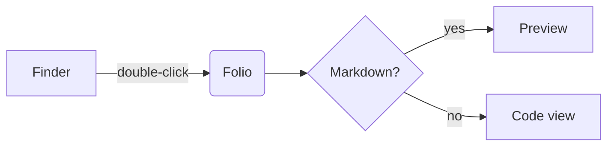

# Folio Sample Project

[](https://example.com) [](LICENSE)

A small project used to exercise **every** part of the renderer: headings, _emphasis_, `inline code`, links, tables, alerts, math, diagrams and more.

> [!NOTE]
> Folio keeps the reading surface quiet. This note uses GitHub's alert syntax.

## Installation

Install the dependencies, then run the development server:

```bash
pnpm install
pnpm tauri dev   # starts the app
```

```ts
export function greet(name: string): string {
  // Comments are italic and tertiary.
  const count = 42;
  return `Hello, ${name}! You have ${count} new messages.`;
}
```

## Features

- [x] CommonMark and GitHub Flavored Markdown
- [x] Syntax highlighting with Shiki
- [ ] Editing (not in v1)

| Feature        | Status | Since |
|:---------------|:------:|------:|
| Tables         | ✓      | 0.1.0 |
| Task lists     | ✓      | 0.1.0 |
| Math           | ✓      | 0.1.0 |

> [!TIP]
> Press <kbd>⌘</kbd> <kbd>/</kbd> to switch between Preview and Code.

> [!WARNING]
> Remote images load by default; turn them off in Settings ▸ Advanced.

### Math

Euler's identity $e^{i\pi} + 1 = 0$ is inline. Display math:

$$
\int_0^1 x^2 \, dx = \frac{1}{3}
$$

### Diagram



### Images


<details>
<summary>More details</summary>

Hidden content with a footnote.[^1]

</details>

See the [guide](docs/guide.md) and the [API notes](api/README.md#endpoints), or jump to [Installation](#installation).

[^1]: Footnotes render at the end of the document.
